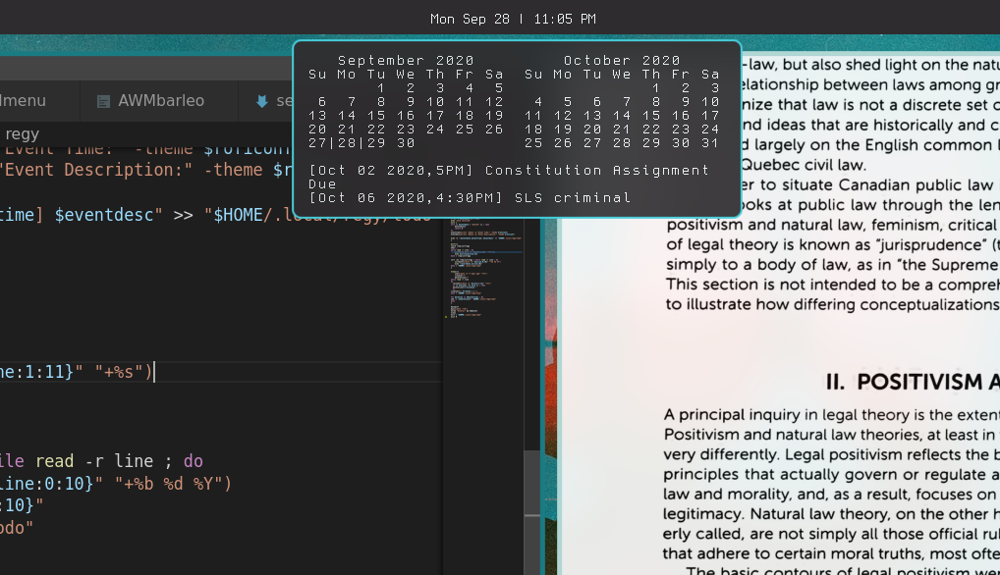

# Regy Calendar + TODO

Regy pulls calendar info from gnu-utils *cal* and *date* and displays them in herbe. When left-clicked the script prompts the user for event info and stores them in a todo file which is displayed below the calendar in herbe.

## Usage
Regy requires [Herbe](https://github.com/dudik/herbe) to display the date and todo information, make sure you have it installed and configured.

By default regy asumes you have [Athanasius](https://github.com/shmalebx9/athanasius) installed, if not, comment out the lines specified in the script and set `roficonf` to your desired theme.

### Creating event
Left-click on herbe to open the event dialogue in rofi. To create a new event, start typing the event's date and select it from the menu. Continue to enter information as prompted. Regy will automatically sort your event in the todo list.

### Deleting an existing event
Left-click to open the event dialogue in rofi but enter "delete" rather than an event date. Select the date you wish to delete. Regy will automatically delete events more than a week old.

## Installation

clone and run the setup script. After this you may move the regy script anywhere in your `$PATH.`Optionally, I've included my herbe config which requires the gohu bitmap font.

	git clone https://github.com/shmalebx9/Regiomontanus
	cd Regiomontanus/
	./setup.sh
	cp regy ~/.local/bin